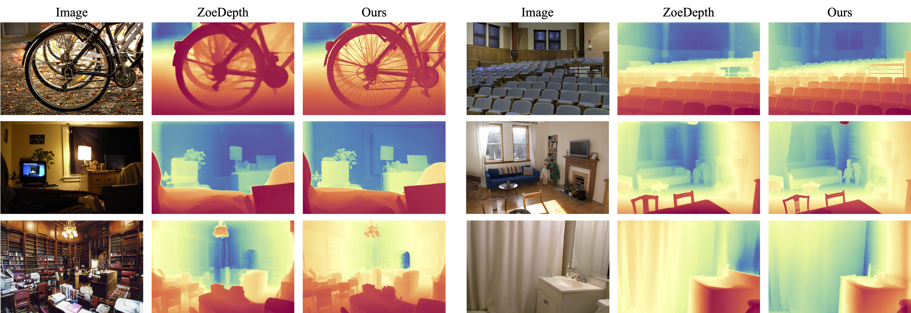

# note_for_DA2
My notes for Depth-Anything-V2 for Metric Depth Estimation.

- [Reference](#reference)
- [Introduction](#introduction)
- [System setup](#system-setup)
- [Script](#script)

## Reference
- [Depth Anything V2 for Metric Depth Estimation](https://github.com/DepthAnything/Depth-Anything-V2/tree/main/metric_depth)

## Introduction
- Fine-tune **Depth Anything V2** pre-trained encoder on synthetic Hypersim / Virtual KITTI datasets for indoor / outdoor metric depth estimation.
- Use the **DPT** head to regress the depth.


## System setup
### Package
```
# torch, torchvison
pip install torch==2.9.0 torchvision==0.24.0 --index-url https://download.pytorch.org/whl/cu126
# xformers
pip3 install -U xformers --index-url https://download.pytorch.org/whl/cu126

# matplotlib
pip install matplotlib
# opencv
pip install opencv-python
```
### Issue
#### Enable long paths in Windows 10, version 1607, and later
- Windows official web : [Enable long paths in Windows 10, version 1607, and later](https://learn.microsoft.com/en-us/windows/win32/fileio/maximum-file-path-limitation?tabs=powershell#enable-long-paths-in-windows-10-version-1607-and-later)
- Solution :
```commandline
New-ItemProperty -Path "HKLM:\SYSTEM\CurrentControlSet\Control\FileSystem" -Name "LongPathsEnabled" -Value 1 -PropertyType DWORD -Force
```
#### ModuleNotFoundError: No module named triton
- Install `triton` package for Windows system
  - Step 1 : Download the Windows `triton` package at the [**HuggingFace**](https://hf-mirror.com/madbuda/triton-windows-builds)
  - Step 2 : Install the `triton` package
    ```commandline
    pip install triton-3.0.0-cp312-cp312-win_amd64.whl
    ```
### Weights
Download the checkpoints listed [**here**](https://github.com/DepthAnything/Depth-Anything-V2/tree/main/metric_depth#pre-trained-models) and put them under the `checkpoints` directory.

## Script
### depth_estimation.py